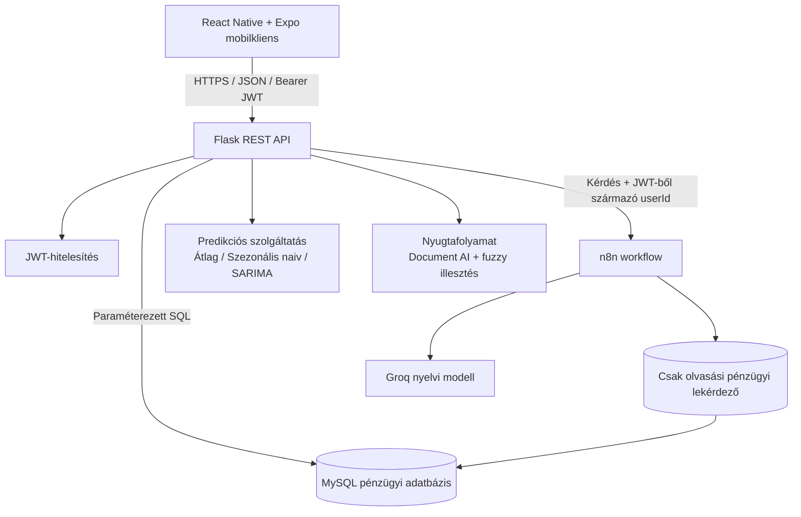
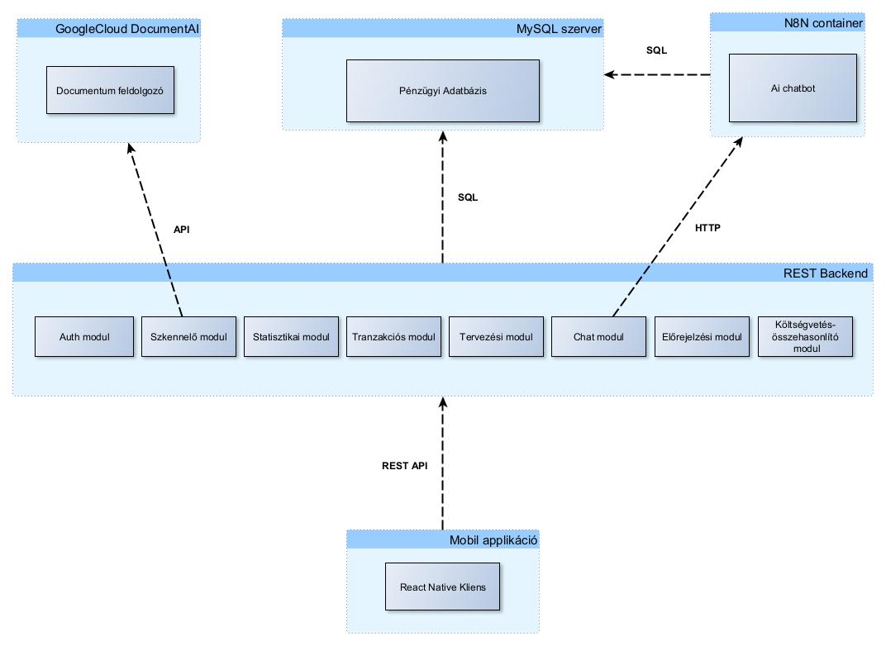
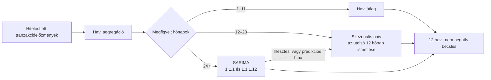
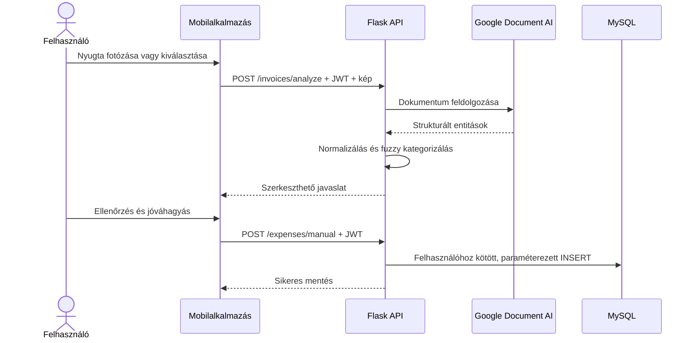

# myEnvelope

**Többplatformos személyes költségvetés-kezelő alkalmazás, amely a borítékos tervezést nyugtafeldolgozással, idősoros előrejelzéssel és természetes nyelvű pénzügyi asszisztenssel kapcsolja össze.**

[English documentation](README.md) · [Architektúra](docs/ARCHITECTURE.hu.md) · [API](docs/API.hu.md) · [Telepítés](docs/SETUP.hu.md) · [Biztonság](SECURITY.md)


## Demó

A felvétel bemutatja a bejelentkezést, a tranzakciórögzítést, a nyugtaolvasást, a statisztikákat, a havi tervezést, a terv–tény–predikció összehasonlítást és a Státi asszisztenst.

Ha a GitHub-kliens nem jeleníti meg a beágyazott lejátszót: **[▶ MP4-demó megnyitása](docs/assets/demo.mp4)**.

> A repó nem tartalmaz éles hitelesítő adatokat vagy valódi pénzügyi rekordokat. A demóban tesztadatok láthatók.

## Miért érdekes ez a projekt?

A myEnvelope nem egymástól független pénzügyi képernyők gyűjteménye. Egyetlen hitelesített adatfolyam szolgálja ki a tervezést, a tényleges költések elemzését, az előrejelzést, a nyugtából támogatott adatbevitelt és a természetes nyelvű lekérdezést.

A projekt az alábbi mérnöki területeket mutatja be:

- közös kódbázisú Android- és iOS-fejlesztés React Native és Expo használatával;
- JWT-vel védett Flask REST API;
- normalizált pénzügyi adattárolás és paraméterezett MySQL-lekérdezések;
- Google Document AI-integráció nyugtaentitások kinyerésére;
- átlátható kulcsszavas és fuzzy kategorizálási logika;
- az adatmennyiség alapján havi átlagot, szezonális naiv módszert vagy SARIMA-modellt választó predikció;
- n8n-orchesztráció Groq által kiszolgált nyelvi modellel;
- környezeti változókra épülő titokkezelés, automatikus tesztek és CI.

## Fő funkciók

| Terület | Funkció |
|---|---|
| Hitelesítés | Regisztráció, bcrypt jelszóhash, bejelentkezés és JWT |
| Tranzakciók | Kiadás és bevétel rögzítése kategóriával, alkategóriával |
| Nyugtafeldolgozás | Képfeltöltés, Document AI, fuzzy kategóriajavaslat, felhasználói jóváhagyás |
| Statisztikák | Egyenleg, összesítések, kategória- és időszakos bontások |
| Tervezés | Havi kiadási és bevételi borítékok kategóriánként |
| Összehasonlítás | Terv, tény és előrejelzés egy közös nézetben |
| Predikció | Összesített és kategóriaszintű kiadási/bevételi becslés |
| Asszisztens | Természetes nyelvű kérdések Flask → n8n → Groq útvonalon |

## Rendszerarchitektúra



A mobilalkalmazás nem csatlakozik közvetlenül sem a MySQL-adatbázishoz, sem a külső MI-szolgáltatásokhoz. A központi bizalmi határ a Flask backend: ellenőrzi a JWT-t, abból állapítja meg a felhasználót, végrehajtja az üzleti logikát, majd JSON-választ küld.

Részletesen: [Architektúra](docs/ARCHITECTURE.hu.md).



## Predikciós stratégia és SARIMA

A `/user/predictions` végpont a kiadásokat és bevételeket naptári hónaponként, majd kategóriánként összesíti. Ezután a rendelkezésre álló havi megfigyelések száma választ módszert:



A rögzített SARIMA-konfiguráció autoregresszív, differenciáló és mozgóátlag-tagot használ, valamint 12 hónapos éves szezonalitást modellez. A negatív pénzösszeg-becslések nullára korlátozódnak. Ha kevés az adat vagy a SARIMA nem illeszthető, a rendszer egyszerűbb, stabilabb alapmodellre esik vissza.

Ez portfólióprototípus, nem validált pénzügyi tanácsadó rendszer. A következő szakmai lépés a gördülő eredetű backtesting, a MAE/RMSE összehasonlítás és a predikciós intervallumok megjelenítése.

## Nyugtafeldolgozás



A nyugtakép és a felismert pénzügyi tartalom nem kerül debug naplóba. A felhasználó mentés előtt módosíthatja az eredményt.

## Technológiák

**Mobil:** React Native 0.81, React 19, Expo 54, React Navigation, AsyncStorage, Chart Kit, Expo Image Picker és Sharing.

**Backend:** Python, Flask, Flask-JWT-Extended, bcrypt, MySQL Connector, pandas, NumPy, statsmodels/SARIMAX, RapidFuzz és Google Cloud Document AI.

**MI-orchesztráció:** n8n webhook, Groq nyelvi modell és hitelesített felhasználóhoz kötött, csak olvasásra szánt MySQL-eszköz.

## Mappaszerkezet

```text
myEnvelope/
├── App.js                       # Navigáció
├── config/api.js                # Nyilvános mobil API-konfiguráció
├── screens/                     # React Native képernyők
├── assets/                      # Alkalmazásikonok
├── backend/
│   ├── app.py                   # Flask REST-végpontok
│   ├── forecast.py              # Modellválasztás és SARIMA
│   ├── invoice_parser.py        # Document AI és kategorizálás
│   ├── schema.sql               # MySQL-séma
│   ├── requirements.txt         # Python-függőségek
│   └── .env.example             # Biztonságos konfigurációs minta
├── n8n/workflow.example.json    # Megtisztított workflow-export
├── tests/                       # Egységtesztek
├── docs/                        # Angol és magyar dokumentáció
└── .github/workflows/ci.yml     # Automatikus ellenőrzés
```

## Gyors indítás

### Előfeltételek

- Node.js 20.19.4+ vagy 22.13+
- npm 10+
- Python 3.11+
- MySQL 8+
- Expo Go vagy Android/iOS-emulátor

### 1. Mobilalkalmazás

```bash
git clone https://github.com/AntiBrs/myEnvelope.git
cd myEnvelope
npm install
cp .env.example .env
```

A `.env` fájlban állítsd be a backend címét:

```dotenv
EXPO_PUBLIC_API_BASE_URL=http://localhost:5000
```

Fizikai telefon esetén a fejlesztői gép helyi hálózati címe szükséges. Ezt ne commitold a repóba.

### 2. Adatbázis

```bash
mysql -u root -p < backend/schema.sql
```

Az alkalmazáshoz hozz létre külön, minimális jogosultságú adatbázis-felhasználót; ne a MySQL root fiókot használd.

### 3. Backend

```bash
python -m venv .venv
source .venv/bin/activate       # Windows: .venv\Scripts\activate
pip install -r backend/requirements.txt
cp backend/.env.example backend/.env
python -m backend.app
```

A `backend/.env` fájlban legalább a `JWT_SECRET_KEY` és `DB_PASSWORD` értékét kötelező lecserélni. A szerver ellenőrzése:

```bash
curl http://localhost:5000/health
```

### 4. Expo

```bash
npm start
```

A teljes telepítéshez és az opcionális Google Document AI/n8n/Groq integrációhoz lásd a [telepítési útmutatót](docs/SETUP.hu.md).

## REST API – rövid áttekintés

| Metódus | Végpont | Hitelesítés | Feladat |
|---|---|---:|---|
| GET | `/health` | Nem | Állapotellenőrzés |
| POST | `/user` | Nem | Regisztráció |
| POST | `/login` | Nem | JWT kiadása |
| POST | `/expenses` | JWT | Kiadás mentése |
| POST | `/earnings` | JWT | Bevétel mentése |
| GET | `/categories` | JWT | Kategóriák lekérése |
| POST | `/invoices/analyze` | JWT | Nyugtakép elemzése |
| POST | `/expenses/manual` | JWT | Jóváhagyott kiadás mentése |
| GET | `/user/summary` | JWT | Egyenleg és összesítések |
| GET | `/user/statistics/:range` | JWT | Időszakos statisztika |
| GET/POST | `/planning` | JWT | Havi terv olvasása vagy mentése |
| GET | `/user/planning/compare` | JWT | Terv–tény összevetés |
| GET | `/user/predictions` | JWT | Predikciók lekérése |
| POST | `/chat` | JWT | Státi asszisztens |

Részletesen: [REST API dokumentáció](docs/API.hu.md).

## Titkok és személyes adatok kezelése

A nyilvános repó kizárólag helykitöltő konfigurációt tartalmaz. A kliens nyilvános beállításai a gyökér `.env`, a szerver titkai a `backend/.env` fájlba kerülnek. A Google service account fájlt a repón kívül kell tárolni, az n8n hitelesítő adatokat pedig az n8n saját credential store-jában kell beállítani.

A `.gitignore` kizárja a környezeti fájlokat, privát kulcsokat, credential JSON-okat, adatbázisokat, feltöltéseket, gyorsítótárakat és buildkimeneteket. Éles telepítés előtt olvasd el a [SECURITY.md](SECURITY.md) fájlt.

## Tesztek és CI

```bash
pytest
```

A tesztek ellenőrzik a rövid adatelőzmény alapmodelljét, a szezonális naiv viselkedést, a nem negatív kimenetet, az európai számformátumot, a szövegnormalizálást és a fuzzy prioritást. A GitHub Actions emellett tiszta Expo web buildet készít.

## Korlátok

- A SARIMA-paraméterek rögzítettek, nem gördülő validáció választja őket.
- A hiányzó hónapok kitöltési stratégiáját valós adatokon össze kell hasonlítani más módszerekkel.
- Az asszisztens demonstráció: élesben kötelező a külön read-only DB-fiók, a táblaengedélyezőlista, a sorlimit, a naplózás és a prompt injection elleni védelem.
- A JWT jelenleg AsyncStorage-ba kerül; kiadott alkalmazásban platformszintű secure storage ajánlott.
- A helyi fejlesztés HTTP-t használ; telepítve HTTPS és reverse proxy szükséges.
- A Document AI minőségét reprezentatív nyugtahalmazon kell mérni.
- Az alkalmazás nem minősül pénzügyi tanácsadásnak.

## Továbbfejlesztési irányok

- gördülő backtesting, MAE/RMSE/MAPE és predikciós intervallum;
- biztonságos tokenkezelés és refresh token;
- tranzakciók módosítása/törlése és auditnapló;
- adatbázis-migráció és konténerizált fejlesztői környezet;
- akadálymentesítés és lokalizáció;
- banki import/Open Banking;
- szigorúbb MI-lekérdezés-validáció és megfigyelhetőség;
- mobil end-to-end tesztek.
- Expo SDK főverzió-frissítés a navigáció, grafikonok és natív modulok kompatibilitási tesztje után.

## Licenc

A projekt a megengedő [Zero-Clause BSD licenc](LICENSE) alatt érhető el.
