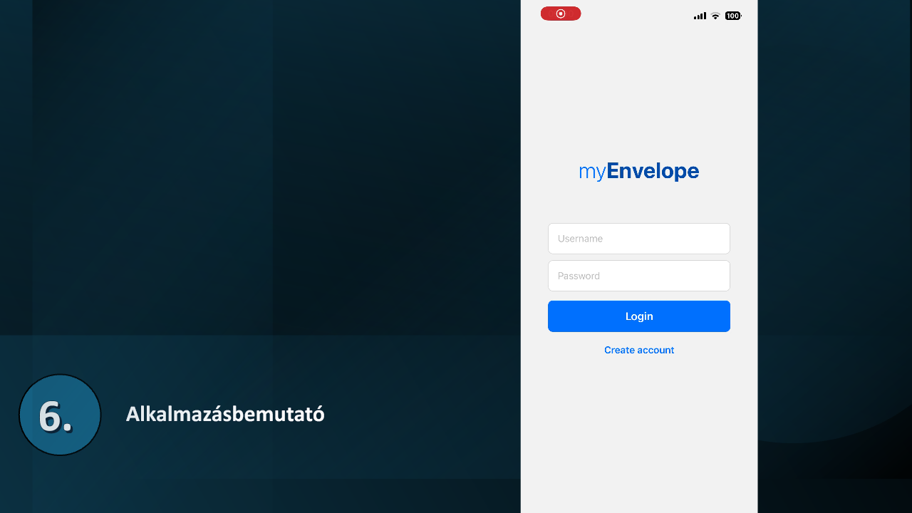
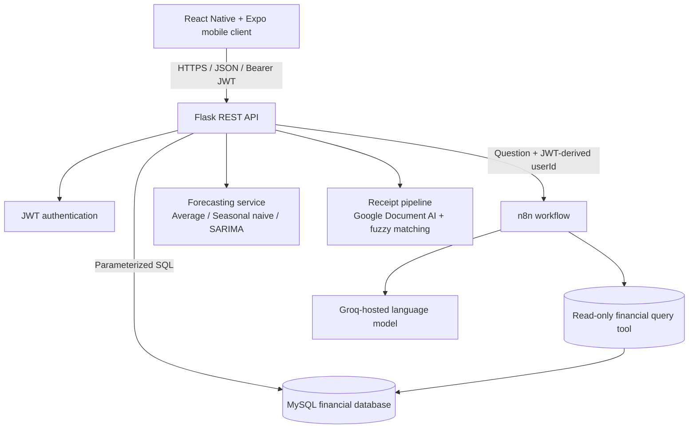
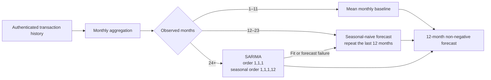
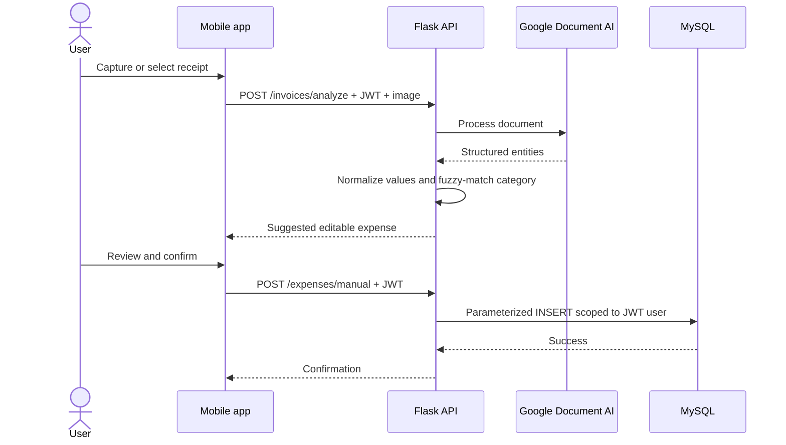

# myEnvelope

**A cross-platform personal budgeting application that combines envelope-style planning, receipt understanding, time-series forecasting, and a natural-language financial assistant.**

[Magyar dokumentáció](README.hu.md) · [Architecture](docs/ARCHITECTURE.md) · [API](docs/API.md) · [Setup](docs/SETUP.md) · [Security](SECURITY.md)


## Demo

The recording walks through authentication, transaction entry, receipt scanning, statistics, monthly planning, forecast comparison, and the Státi assistant.


[](docs/assets/demo.mp4)

**[▶ Open the MP4 demo directly](docs/assets/demo.mp4)** if the inline player is not available in your GitHub client.

> The repository contains no production credentials or real financial records. The demo shows synthetic/test data.

## Why this project is interesting

myEnvelope is more than a set of independent finance screens. A single authenticated data flow supports planning, actual spending analysis, forecasts, receipt-assisted entry, and conversational queries.

The project demonstrates:

- cross-platform mobile development with React Native and Expo;
- a JWT-protected Flask REST API;
- normalized financial storage and parameterized MySQL queries;
- Google Document AI integration for receipt entity extraction;
- explainable keyword and fuzzy-matching logic for suggested categories;
- adaptive forecasting that selects a baseline, seasonal-naive method, or SARIMA according to history length;
- n8n orchestration with a Groq-hosted language model and a read-only financial query pattern;
- environment-based secret management, automated tests, and CI validation.

## Product capabilities

| Area | Capability |
|---|---|
| Authentication | Registration, bcrypt password hashing, login, JWT-protected requests |
| Transactions | Manual income and expense entry with categories and subcategories |
| Receipt processing | Image upload, Document AI extraction, fuzzy category suggestion, user confirmation |
| Statistics | Totals, balances, category breakdowns, and time-range summaries |
| Planning | Monthly income and expense envelopes by category |
| Comparison | Planned vs. actual vs. forecast values in one view |
| Forecasting | Total and category-level projections for expenses and earnings |
| Assistant | Natural-language financial questions through Flask → n8n → Groq |

## System architecture



The mobile client never connects directly to MySQL or to external AI services. Flask is the central trust boundary: it authenticates the request, derives the user identity from the JWT, applies application logic, and returns JSON responses.

See [Architecture](docs/ARCHITECTURE.md) for component responsibilities, data flows, and security boundaries. The original thesis component diagram is also available below.


## Forecasting strategy

The prediction endpoint aggregates transactions into monthly totals separately for expenses, earnings, and each category. The available history determines the forecasting method:



The fixed SARIMA configuration captures autoregressive behavior, differencing, moving-average error structure, and yearly seasonality. Negative monetary predictions are clamped to zero. Explicit baseline fallbacks allow the API to return a useful result when a user's history is short or SARIMA fitting fails.

This is a portfolio prototype, not a validated financial-advice system. A production iteration should select and compare models through rolling-origin backtesting and report MAE/RMSE plus prediction intervals.

## Receipt-processing flow



The raw receipt image and extracted values are not printed to logs. The user remains in control and can correct the suggestion before it is stored.

## Technology stack

### Mobile

- React Native 0.81 and React 19
- Expo SDK 54
- React Navigation
- AsyncStorage for the local JWT session
- React Native Chart Kit
- Expo Image Picker and Sharing

### Backend and data

- Python and Flask
- Flask-JWT-Extended
- bcrypt password hashing
- MySQL Connector/Python
- pandas, NumPy, statsmodels/SARIMAX
- RapidFuzz
- Google Cloud Document AI

### AI orchestration

- n8n webhook workflow
- Groq-hosted language model
- MySQL select tool constrained by the authenticated user identifier

## Repository layout

```text
myEnvelope/
├── App.js                       # Navigation composition
├── config/api.js                # Public mobile API configuration
├── screens/                     # React Native feature screens
├── assets/                      # Application icons and splash assets
├── backend/
│   ├── app.py                   # Flask routes and application logic
│   ├── forecast.py              # Forecast selection and SARIMA model
│   ├── invoice_parser.py        # Document AI parsing and categorization
│   ├── schema.sql               # Reproducible MySQL schema
│   ├── requirements.txt         # Python dependencies
│   └── .env.example             # Safe server configuration template
├── n8n/workflow.example.json    # Sanitized assistant workflow export
├── tests/                       # Forecast and parser unit tests
├── docs/                        # English and Hungarian documentation
└── .github/workflows/ci.yml     # Backend tests and Expo web build
```

## Quick start

### Prerequisites

- Node.js 20.19.4+ or 22.13+
- npm 10+
- Python 3.11+
- MySQL 8+
- Expo Go or an Android/iOS emulator

Google Document AI, n8n, and Groq are optional integrations. The core authentication, transactions, statistics, planning, and forecasting features can be studied without publishing credentials.

### 1. Clone and install the mobile application

```bash
git clone https://github.com/AntiBrs/myEnvelope.git
cd myEnvelope
npm install
cp .env.example .env
```

Set the Flask address in `.env`:

```dotenv
EXPO_PUBLIC_API_BASE_URL=http://localhost:5000
```

For a physical phone, use the development computer's LAN address instead of `localhost`. Do not commit that address if it identifies a private network.

### 2. Create the database

```bash
mysql -u root -p < backend/schema.sql
```

Create a dedicated least-privilege database user and avoid using the MySQL root account from the application.

### 3. Configure and start the backend

```bash
python -m venv .venv
source .venv/bin/activate       # Windows: .venv\Scripts\activate
pip install -r backend/requirements.txt
cp backend/.env.example backend/.env
python -m backend.app
```

At minimum, replace `JWT_SECRET_KEY` and `DB_PASSWORD` in `backend/.env`. Generate the JWT secret with a cryptographically secure random generator:

```bash
python -c "import secrets; print(secrets.token_urlsafe(48))"
```

Verify the server:

```bash
curl http://localhost:5000/health
```

### 4. Start Expo

```bash
npm start
```

Then open the project in Expo Go or choose an emulator from the Expo terminal interface. For complete setup and optional integrations, read [Setup](docs/SETUP.md).

## REST API overview

| Method | Endpoint | Authentication | Purpose |
|---|---|---:|---|
| GET | `/health` | No | Service health check |
| POST | `/user` | No | Register a user |
| POST | `/login` | No | Return a JWT access token |
| POST | `/expenses` | JWT | Store an expense |
| POST | `/earnings` | JWT | Store an earning |
| GET | `/categories` | JWT | Return supported categories |
| POST | `/invoices/analyze` | JWT | Analyze a receipt image |
| POST | `/expenses/manual` | JWT | Confirm and store an extracted expense |
| GET | `/user/summary` | JWT | Return balance and totals |
| GET | `/user/statistics/:range` | JWT | Return time-range statistics |
| GET/POST | `/planning` | JWT | Read or save a monthly plan |
| GET | `/user/planning/compare` | JWT | Compare planned and actual expenses |
| GET | `/user/predictions` | JWT | Return total and category forecasts |
| POST | `/chat` | JWT | Ask the n8n-based assistant |

Full request and response notes are in [API documentation](docs/API.md).

## Configuration and secrets

The public repository intentionally contains placeholders only. Runtime configuration is split into:

- root `.env`: public Expo variables such as the API base URL;
- `backend/.env`: server-only secrets and service identifiers;
- Google service-account JSON: stored outside the repository and referenced by an absolute path;
- n8n credentials: configured inside n8n, not exported into the example workflow.

Files matching environment files, credential JSON patterns, private keys, local databases, uploads, caches, and build output are ignored. See [Security](SECURITY.md) before deploying the prototype.

## Tests and continuous integration

Run backend tests locally:

```bash
pytest
```

The suite covers short-history baseline selection, seasonal-naive behavior, non-negative output, European price parsing, normalization, and fuzzy-match priority.

GitHub Actions performs Python compilation and tests, plus a clean Expo web export.

## Engineering trade-offs and current limitations

- SARIMA parameters are fixed rather than selected by rolling validation.
- Missing monthly values are currently imputed to obtain a regular series; production experiments should compare zero-filling, interpolation, and domain-specific rules.
- The assistant workflow is a demonstration. Production use requires a dedicated read-only database account, strict table allowlisting, result limits, audit logging, and prompt-injection defenses.
- The prototype stores the JWT in AsyncStorage. A hardened release should use platform secure storage and short-lived tokens with refresh-token rotation.
- Local development uses HTTP. Deployed environments must use HTTPS and a reverse proxy.
- Receipt extraction depends on the configured Document AI processor and should be evaluated on representative receipts.
- The project does not provide regulated financial advice.

## Roadmap

- rolling-origin backtesting with MAE, RMSE, MAPE, and prediction intervals;
- secure token storage and refresh-token lifecycle;
- edit/delete transaction endpoints and audit history;
- database migrations and containerized local development;
- accessibility and localization improvements;
- bank import/Open Banking integration;
- stronger assistant query validation and observability;
- automated end-to-end mobile tests.
- Expo SDK major-version upgrade after compatibility testing of navigation, charts, and native modules.

## Documentation

| English | Magyar |
|---|---|
| [README](README.md) | [README](README.hu.md) |
| [Setup guide](docs/SETUP.md) | [Telepítési útmutató](docs/SETUP.hu.md) |
| [Architecture](docs/ARCHITECTURE.md) | [Architektúra](docs/ARCHITECTURE.hu.md) |
| [REST API](docs/API.md) | [REST API](docs/API.hu.md) |

## License

Released under the permissive [Zero-Clause BSD License](LICENSE).
