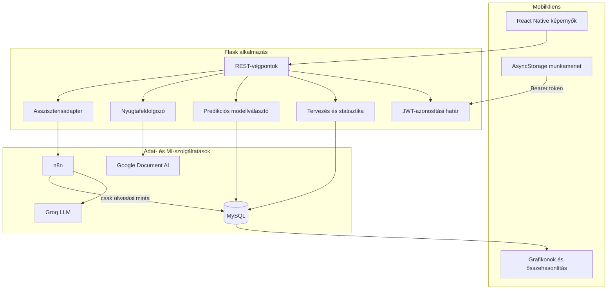
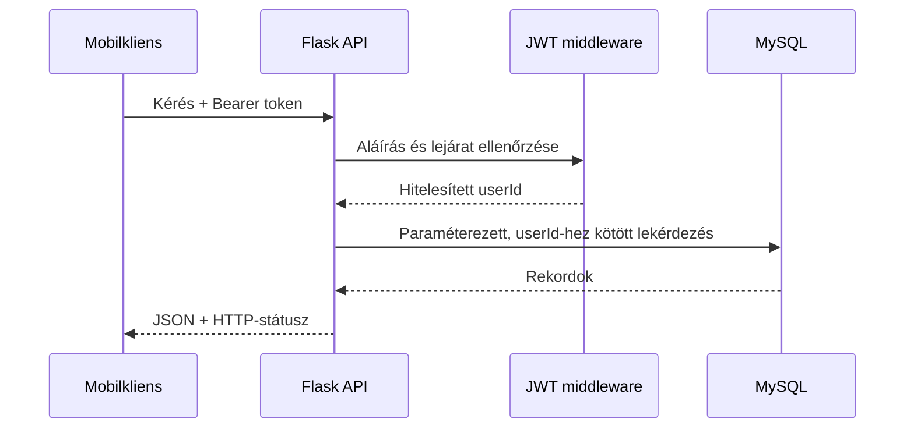

# Architektúra

[English version](ARCHITECTURE.md) · [Vissza a README-hez](../README.hu.md)

## Architekturstílus

A myEnvelope kliens–szerver architektúrát használ: React Native mobilkliens, Flask REST API és MySQL adattároló. Az opcionális MI-funkciók a backend mögötti adapterek, ezért a mobilalkalmazás nem kapcsolódik közvetlenül külső szolgáltatásokhoz.

## Komponensek felelőssége

### React Native kliens

- bekéri a felhasználói adatokat és megjeleníti a szerver válaszait;
- eltárolja a prototípus aktuális hozzáférési tokenjét;
- `Authorization: Bearer …` fejlécet küld a védett kéréseknél;
- a tervet, tényadatot és predikciót közös összehasonlító nézetté komponálja;
- mentés előtt lehetővé teszi a Document AI eredményének ellenőrzését.

A kliens nem tartalmaz adatbázis-jelszót, JWT-titkot, Google service accountot, Groq-kulcsot vagy n8n-hitelesítő adatot. Az `EXPO_PUBLIC_API_BASE_URL` nyilvános konfiguráció, mivel az Expo ezt beépíti az alkalmazásba.

### Flask REST API

A Flask a központi bizalmi határ. Feladata:

1. a JWT ellenőrzése;
2. a `userId` kinyerése a tokenből;
3. paraméterezett, felhasználóhoz kötött SQL végrehajtása;
4. a statisztika, tervezés, nyugtafeldolgozás, predikció és chat koordinálása;
5. stabil JSON-válaszok előállítása;
6. a szolgáltatási titkok szerveroldali környezeti változókban tartása.

### MySQL

A séma külön táblában kezeli a felhasználókat, kiadásokat, bevételeket és havi terveket. Minden pénzügyi rekord `userId`-hez tartozik. A Planning tábla felhasználó, év, hónap, kategória és típus szerint egyedi, így a mentés upsert műveletet használhat.

### Predikciós szolgáltatás

A predikció klasszikus, determinisztikus Python-komponens, nem generatív MI. A Flaskből kapott tranzakciókat havi idősorrá alakítja, az adatmennyiség alapján modellt választ, majd DataFrame-ben adja vissza az eredményt.

| Előzmény | Módszer | Indok |
|---:|---|---|
| 1–11 hónap | Havi átlag | Stabil, kis varianciájú megoldás kevés adatnál |
| 12–23 hónap | Szezonális naiv | Egy teljes éves mintát használ nagy modell nélkül |
| 24+ hónap | SARIMA `(1,1,1)(1,1,1,12)` | Autoregresszió, differenciálás, hibastruktúra és éves szezonalitás |

SARIMA-hiba esetén a rendszer szezonális naiv módszerre vált. A negatív becslések nullára korlátozódnak, mert a tartományban negatív kiadás vagy bevétel nem értelmezhető.

### Nyugtaadapter

A backend a feltöltött képet a konfigurált Google Document AI processzornak küldi. A kapott entitásokat normalizálja és deduplikálja, majd verziókövetett CSV-k és RapidFuzz segítségével kategóriát javasol. A tételszintű bizonyíték magasabb súlyt kap, a kereskedőnév pedig fallback. Az eredmény mentésig csak szerkeszthető javaslat.

A publikus változat nem naplózza a nyugtaképet vagy a felismert szöveget.

### Asszisztensadapter

A `/chat` végpont kizárólag a kérdést és a JWT-ből származó felhasználóazonosítót küldi az n8n webhooknak. Az n8n kapcsolja össze a Groq modellt a MySQL select eszközzel. A hitelesítő adatok az n8n credential store-jában maradnak; az export csak helykitöltőket tartalmaz.

Éles rendszerben a csak olvasási korlátozást technikailag is ki kell kényszeríteni: külön read-only DB-fiók, tábla- és oszlopengedélyezőlista, sorlimit, paramétervalidáció és auditnapló szükséges.

## Fontos adatfolyamok

### Hitelesített REST-kérés

### Predikció

1. A `GET /user/predictions` kérés áthalad a JWT middleware-en.
2. A Flask lekéri a felhasználó kiadásait és bevételeit.
3. Összesített és kategóriánkénti adathalmazokat hoz létre.
4. A modellválasztó havi aggregációt végez.
5. Átlag, szezonális naiv vagy SARIMA fut.
6. A Flask hónap, összeg és kategória formában JSON-ná alakítja az eredményt.
7. Ugyanezt az erőforrást használja a predikciós és az összehasonlító képernyő.

### Terv–tény–predikció

Az összehasonlító képernyő három párhuzamos GET-kérést indít: havi terv, aktuális statisztika és predikció. Ez tisztán tartja a backend erőforrásait. Ha a hálózati késleltetés fontossá válik, egy BFF-összesítő végpont csökkentheti a körutakat.

## Biztonsági határok

| Határ | Jelenlegi védelem | Éles megerősítés |
|---|---|---|
| Mobil → Flask | JWT az Authorization fejlécben | HTTPS, secure storage, tokenrotáció, rate limit |
| Flask → MySQL | Paraméterezett SQL és userId-szűrés | Minimális DB-jog, TLS, migráció, audit |
| Flask → Document AI | Szerveroldali credential | Korlátozott service account, adatmegőrzési felülvizsgálat |
| Flask → n8n | Szerveroldali webhook | Aláírt kérés, privát hálózat, replay-védelem |
| n8n → MySQL | Select workflow-minta | Read-only fiók, allowlist, sorlimit és naplózás |

## Továbbfejleszthető telepítés

Éles környezetben a Flask TLS reverse proxy és production WSGI szerver mögé kerülne, a titkokat secret manager kezelné, a MySQL privát hálózaton futna, és strukturált monitoring készülne. A stateless REST-réteg horizontálisan skálázható; nagyobb adatmennyiségnél a modellillesztés cache-be vagy háttérfeladatba helyezhető.
