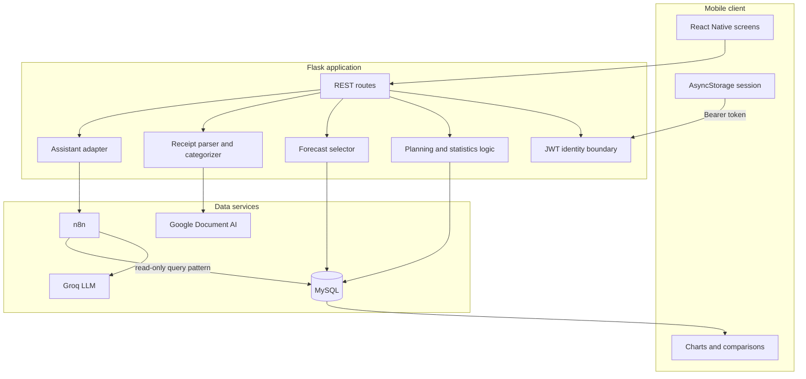
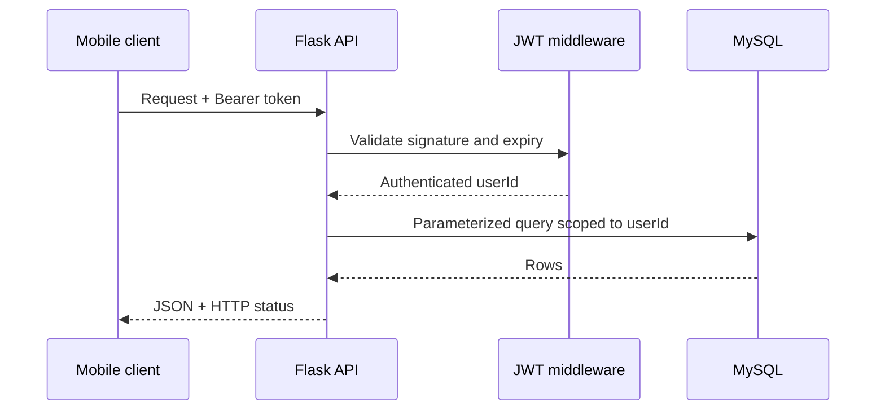

# Architecture

[Magyar változat](ARCHITECTURE.hu.md) · [Back to README](../README.md)

## Architectural style

myEnvelope uses a client–server architecture with a React Native mobile client, a Flask REST API, and MySQL persistence. Optional AI capabilities are adapters behind the backend boundary rather than direct mobile dependencies.

## Component responsibilities

### React Native client

- collects user input and displays server responses;
- stores the access token for the current prototype session;
- attaches the token as `Authorization: Bearer …` to protected requests;
- combines plan, actual, and prediction resources in the comparison screen;
- lets the user review Document AI output before saving it.

The client contains no database credentials, JWT secret, Google service-account data, Groq key, or n8n credentials. `EXPO_PUBLIC_API_BASE_URL` is intentionally public because Expo bundles public variables into the application.

### Flask REST API

Flask is the system's central trust boundary. It:

1. validates the JWT on protected routes;
2. derives `userId` from the token rather than accepting it as an authoritative client field;
3. uses parameterized SQL for user data;
4. coordinates planning, statistics, receipt processing, forecasting, and chat;
5. converts results to stable JSON responses;
6. keeps service secrets in server-side environment variables.

### MySQL

The schema separates users, expenses, earnings, and monthly planning rows. Every financial row is associated with a `userId`. Planning uses a unique key over user, year, month, category, and type so a save can use an upsert.

Main indexes follow the dominant access path: `userId + date` for transactions and the unique monthly planning key for envelopes.

### Forecasting service

The forecast module is a deterministic Python component, not a generative-AI call. It receives transaction records from Flask, produces a regular monthly series, chooses the method by history length, and returns a DataFrame serialized by the API.

| History | Method | Reason |
|---:|---|---|
| 1–11 months | Mean monthly total | Low-variance fallback for sparse history |
| 12–23 months | Seasonal naive | Uses a full annual pattern without overfitting a larger model |
| 24+ months | SARIMA `(1,1,1)(1,1,1,12)` | Models autoregression, differencing, moving-average error and yearly seasonality |

If SARIMA fitting or forecasting fails, the selector falls back to seasonal naive. Predictions are clamped at zero because a negative expense or earning forecast is invalid in this domain.

### Receipt adapter

The backend sends uploaded receipt bytes to a configured Google Document AI processor. Returned entities are normalized and de-duplicated. Product/vendor strings are matched against versioned CSV keyword data with RapidFuzz; item evidence receives a scoring weight and vendor matching is the fallback. The result is only a suggestion until the user confirms it.

No raw receipt content or extracted entity text is logged by the public implementation.

### Assistant adapter

The `/chat` route forwards only the question and the JWT-derived user identifier to an n8n webhook. n8n connects the Groq-hosted model to a MySQL select tool. Credentials remain inside n8n and are represented only by placeholders in the exported example workflow.

The workflow is a demonstrator. A deployment must enforce the read-only guarantee technically, not only through prompt text: use a dedicated read-only DB account, restrict tables/columns, cap returned rows, validate parameters, and audit tool calls.

## Key data flows

### Authenticated REST request

### Forecast request

1. `GET /user/predictions` enters through the JWT middleware.
2. Flask loads expenses and earnings for the authenticated user.
3. Total and category-specific record sets are created.
4. The forecast selector aggregates each set by month.
5. Baseline, seasonal-naive, or SARIMA prediction runs.
6. Flask serializes month, predicted amount, and category.
7. The client renders lists and the comparison screen consumes the same resource.

### Plan–actual–forecast composition

The comparison screen performs three concurrent GET requests: plan, current-month statistics, and predictions. This keeps the backend resources focused while the client composes the view. A future API gateway/BFF endpoint could reduce round trips if latency becomes important.

## Security boundaries

| Boundary | Current control | Production hardening |
|---|---|---|
| Mobile → Flask | JWT in Authorization header | HTTPS, secure token storage, refresh rotation, rate limits |
| Flask → MySQL | Parameterized SQL and user scoping | Least-privilege account, TLS, migrations, audit logs |
| Flask → Document AI | Server-side credentials | Restricted service account, retention review, regional processor |
| Flask → n8n | Server-only webhook URL | Signed requests, private network, timeouts, replay protection |
| n8n → MySQL | Select-style workflow | Read-only account, allowlist, row limits, query audit |

## Deployment evolution

The current code is intentionally small enough to run locally. A production topology would place Flask behind a TLS reverse proxy, run it with a production WSGI server, manage secrets in a secret manager, place MySQL on a private network, and add structured monitoring. The stateless REST layer can then scale horizontally; model training can be cached or moved to background jobs if the dataset grows.
